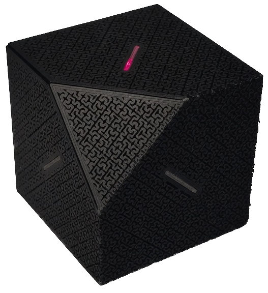
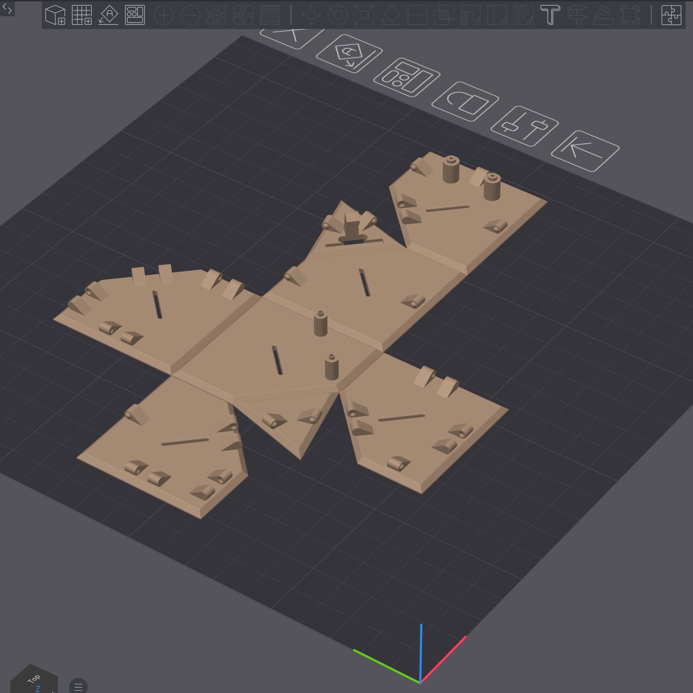
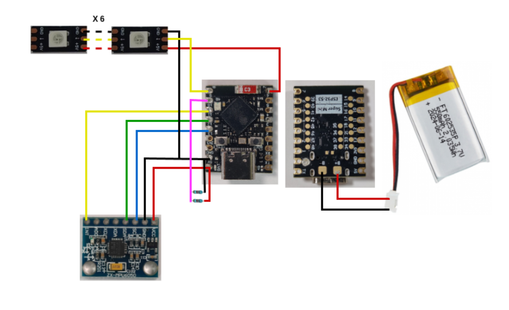
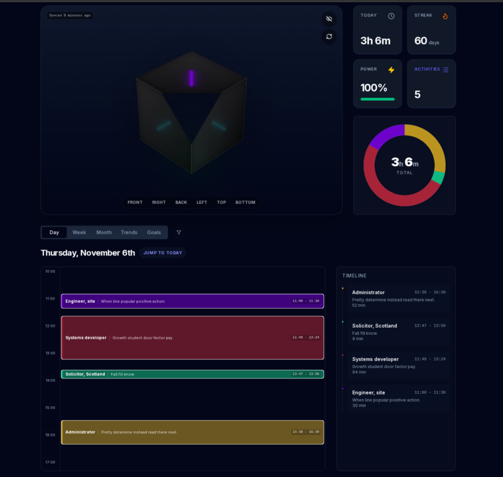

# FlipBuddy

[](./.github/workflows/ci.yml)
[](./LICENSE)
[](./LICENSE-HARDWARE)
[](./docs/CHANGELOG.md)
[](https://micropython.org/)

I kept forgetting to start the timer on my phone. FlipBuddy is my fix for that: a printed cube on the desk. You flip a face up, that activity is on. The LEDs show the color you picked in the free app at [flipbuddy.app](https://flipbuddy.app). No app hunt every time you switch tasks.

I thought it would take a weekend. It took months. That’s fine. The result is still a simple cube: flip a face, log the time, check the history later in the app if you want.

This repository is the open DIY build. Firmware is **0.1.0**. It runs on a stock ESP32-S3 (Super Mini class works well) with MicroPython. The shell STLs and assembly PDF are here too. I publish it under **Ponderly Robotics** and work on it when evenings allow, so please treat it as a hobby project, not a product with phone support.

<p align="center">
  
</p>

If you only want to build one, start with the [assembly PDF](./FlipBuddy%20Assembly%20guide.pdf), the files in [stl/](./stl/), the firmware `.bin` from GitHub Releases, then `main.py` and your `credentials.json`. You can ignore `scripts/`, pre-commit, and the rest of the host tooling. People changing the code should read [CONTRIBUTING.md](./CONTRIBUTING.md).

| | |
|--|--|
| Firmware image | `esp32_s3_flipbuddy_0.1.0.bin` on GitHub Releases (MicroPython 1.27; helpers frozen in; not in git) |
| Enclosure | [stl/](./stl/) v0.1.0 |
| Assembly | [FlipBuddy Assembly guide.pdf](./FlipBuddy%20Assembly%20guide.pdf) |
| Software license | [MIT](./LICENSE) |
| Hardware license | [CC BY-NC-SA 4.0](./LICENSE-HARDWARE) |

The design is for minutes and hours, not a stopwatch. It prefers boards you can buy today. Other custom modules are not in this tree yet.

## Contents

- [Features in short](#features-in-short)
- [Day to day](#day-to-day)
- [Battery (rough)](#battery-rough)
- [Getting started](#getting-started)
  - [Serial port and board](#serial-port-and-board-justfile)
  - [Fast track (v0.1.0)](#fast-track-v010)
  - [DIY path](#diy-path)
- [Assembly, printing, and parts](#assembly-printing-and-parts)
- [Web app](#web-app)
- [FAQ](#faq)
- [Bugs](#bugs)
- [Contributing](#contributing)
- [License](#license)
- [Links](#links)

## Features in short

- Up to 8 faces (one can be stop)
- Snap-fit printed shell
- RGB LEDs for activity colors from the app
- Deep sleep and longer sleeps on the stop face
- Free web app for names, colors, history, optional AI
- More than one cube per account (stop one in the app before using another a lot)

## Day to day

You set activity names and colors in the browser. The cube only records sessions. Config updates land when the cube next wakes and syncs.

Wi-Fi is used for uploads, sometimes on the stop face, and when USB is plugged in. On stop, sleep intervals grow so the battery lasts longer.

If Wi-Fi is down but credentials are already installed, the cube still boots and can log with defaults. Full face colors and history still need flipbuddy.app for normal use.

USB-C face up opens a local AP that can show data not yet uploaded. Blinking all leds red often means bad orientation or low battery. AI in the app can be turned off.

### Which face is which?

If you have looked at photos or printed one already, you may think: this thing is symmetric, so which side is front, left, or “programming”?

I could have put a different emblem, number, texture, or color on each face. I actually tried. My OCD did not approve of any of them.

So it works like this: when you grab, move, or tap the cube, the accelerometer wakes it and every face that has an activity lights up in that activity’s color. The lights stay on for a few seconds (about 5–7) and dim so you can see the map. I do not need to know if “Human Programming” is assigned to left or bottom. I only need it flashing green and pointing up. Orange is “AI shenanigans” for me. Whichever physical face that is does not matter. Color on top is enough.

## Battery (rough)

With a ~550 mAh LiPo, order-of-magnitude only:

| Scenario | Avg current | Est. life |
|----------|-------------|-----------|
| Continuous tracking | ~7.4 mA | ~3 days |
| Long stop-face (backoff ~15 min) | ~0.8 mA | ~28 days |
| Mixed use (~10 h tracking/day) | ~3.5 mA | ~6.5 days |

See comments in `main.py` (`prepare_for_deep_sleep`) and `fsm.dot` for the assumptions.

## Getting started

Build and wire the cube first ([assembly section](#assembly-printing--bom) and the [PDF](./FlipBuddy%20Assembly%20guide.pdf)). Pins live in `main.py` / `mpu6050.py`.

| Path | Use when | What you put on the device |
|------|----------|----------------------------|
| [Fast track](#fast-track-v010) | ESP32-S3 Super Mini (or similar) with charger | Release `.bin`, then `main.py` + `credentials.json` |
| [DIY path](#diy-path) | Other boards, or you want every `.py` on the filesystem | Stock MicroPython + all sources + credentials |

### Serial port and board (`justfile`)

Defaults target an ESP32-S3 Super Mini (4 MB flash) on Linux. Edit the top of [justfile](./justfile) or set `AMPY_PORT`:

```just
usb_dev := env("AMPY_PORT", "/dev/ttyACM0")
esp_chip := "s3"
esp_flash_size := "4MB"
```

| Setting | Default | Notes |
|---------|---------|--------|
| `usb_dev` / `AMPY_PORT` | `/dev/ttyACM0` | Also try `/dev/ttyUSB0`, `COM3`, `/dev/cu.usbmodem*` |
| `esp_chip` | `s3` | Becomes `esp32s3` for esptool |
| `esp_flash_size` | `4MB` | Match your module when picking MicroPython builds |

```bash
just env
```

The Release fast-track image is ESP32-S3 only. Other chips need the DIY path. Commands below use `/dev/ttyACM0` and `esp32s3`; change them if you are not using `just`.

### Fast track (v0.1.0)

Helpers are frozen into the image. You only place `main.py` and `credentials.json` on the filesystem so you can tweak the entrypoint without rebuilding MicroPython.

| | |
|--|--|
| Image | `esp32_s3_flipbuddy_0.1.0.bin` from GitHub **Releases** |
| Checksum | Matching `.bin.sha256` or `SHA256SUMS` on the same release |
| Runtime | MicroPython 1.27 |
| Board | ESP32-S3 Super Mini class with battery charger |

#### 1. Download, verify, flash

Use this README for flashing. The assembly PDF is for mechanics; if it only mentions stock MicroPython, prefer the frozen Release image for Super Mini.

On GitHub: **Releases** → tag **v0.1.0** (or latest 0.1.x). Download the `.bin` and checksum file.

```bash
sha256sum -c esp32_s3_flipbuddy_0.1.0.bin.sha256

esptool --chip esp32s3 --port /dev/ttyACM0 erase-flash
esptool --chip esp32s3 --port /dev/ttyACM0 --baud 460800 write-flash 0 esp32_s3_flipbuddy_0.1.0.bin
```

Or, with the file in the repo directory:

```bash
just flash-firmware esp32_s3_flipbuddy_0.1.0.bin
```

#### 2. Credentials

1. Create a free account at [flipbuddy.app](https://flipbuddy.app)
2. Register a device and download `credentials.json`
3. Add your Wi-Fi (people often skip this):

```json
{
  "device_id": "...",
  "device_token": "...",
  "api_url": "https://api.flipbuddy.app/v1/api/",
  "wifi": {
    "home": { "ssid": "YourWiFi", "password": "secret" }
  }
}
```

The firmware scans for visible SSIDs before connecting. For a hidden network, set `"hidden": true` on that entry.

#### 3. Upload `main.py` and credentials

Put `credentials.json` next to the `justfile`, then:

```bash
just fast-track
# same as: just put-main && just put-credentials
```

That only pushes **`main.py`** and **`credentials.json`**. Do not run `just diy` / `just upload` on the fast track unless you mean to override frozen modules.

Manual equivalent (if you do not use `just`):

```bash
mpremote connect /dev/ttyACM0 cp main.py :
mpremote connect /dev/ttyACM0 cp credentials.json :
```

#### 4. Power cycle

On first boot it will try Wi-Fi, calibrate, fetch face config, then track flips. LEDs should match dashboard colors. Use `just shell` or any 115200 serial console if something looks wrong. Shake the cube if it went to sleep.

### DIY path

For other boards, stock MicroPython, or editing modules on the filesystem.

Get a MicroPython build for your chip and flash size from [micropython.org](https://micropython.org/download/) (1.27+ is a good match). Adjust `justfile` chip/port/flash size as needed.

```bash
esptool --chip esp32s3 --port /dev/ttyACM0 erase-flash
esptool --chip esp32s3 --port /dev/ttyACM0 --baud 460800 write-flash 0 ESP32_GENERIC_S3-....bin
# or: just flash-firmware ESP32_GENERIC_S3-....bin
```

Credentials: same as fast track step 2 (`credentials.json` next to the `justfile`).

```bash
just diy
# same as: just upload && just put-credentials
```

That pushes the firmware modules listed in `device_py` plus credentials. Then power cycle.

## Assembly, printing, and parts

### Guide

- [FlipBuddy Assembly guide.pdf](./FlipBuddy%20Assembly%20guide.pdf): BOM, print list, photos, fold order
- Flash steps: this README (fast track above)

The PDF **Bill of Materials** and **Parts to Print** sections are the shopping and print lists. Tables below are a short summary plus the firmware pin map.

### Photos

| File | Content |
|------|---------|
| [docs/media/hero-desk.png](./docs/media/hero-desk.png) | Finished cube |
| [docs/media/print-plate.png](./docs/media/print-plate.png) | Net in the slicer |
| [docs/media/wiring-schematic.png](./docs/media/wiring-schematic.png) | Board, MPU, LEDs, battery |
| [docs/media/dashboard.png](./docs/media/dashboard.png) | Web app |

<p align="center">
  
</p>

### STLs (`stl/`)

Enclosure **v0.1.0**, same pinout as firmware 0.1.0:

| File | Role |
|------|------|
| `tolerance_20_…_net.stl` … `tolerance_40_…_net.stl` | Shell nets (tighter → looser fit) |
| `flipbuddy_con_v0.1.0_led_clip.stl` | LED clip |
| `flipbuddy_con_v0.1.0_led_light_guide.stl` | Light guide |
| `flipbuddy_con_v0.1.0_new_mpu6050_clip.stl` | Sensor clip |
| `tolerance_check.stl` | Print first to choose a net |
| `flipbuddy_con_v0.1.0_new_led.FCStd` | FreeCAD (LED-related) |

Print the tolerance check, pick a net, then clips and guides. PLA or PETG at ~0.2 mm layers works for many printers. Follow the PDF for glue points and fold order.

### Pins (Super Mini path)

Use the GPIO numbers on the silkscreen. Super Mini clones are not all identical.

| Function | GPIO |
|----------|------|
| NeoPixel VCC gate | 7 |
| NeoPixel data | 8 |
| Battery ADC | 9 |
| MPU INT | 10 |
| I2C SDA | 11 |
| I2C SCL | 12 |
| Onboard LED (if used) | 48 |

LED index order in `rgb.py` (DIN starts at 0): back, left, front, bottom, right, top.

Mount the MPU as in the PDF photos; wrong orientation means wrong faces with “working” firmware.

Worth a quick breadboard test before final soldering: flash, credentials, one LED on 7/8, MPU on 10–12, serial at 115200, shake to wake.

<p align="center">
  
</p>

### Parts (summary)

Full list with notes: assembly PDF → **Bill of Materials**.

| Function | Spec | Qty |
|----------|------|----:|
| MCU | ESP32-S3 Supermini, USB-C, onboard charger preferred | 1 |
| IMU | MPU6050 / GY-521 | 1 |
| Battery | 3.7 V protected LiPo ~550 mAh | 1 |
| LEDs | WS2812B 5050 | 6 |
| Optional ADC divider | 470 kΩ | 2 |

Print: one net, six guides, six LED clips, one MPU clip (STLs in `stl/`).

Buy a Super Mini-class board that fits the shell cutout and shows GPIO labels for 7–12. Shop links go stale quickly, so the PDF does not hard-code store URLs.

Expect intermediate DIY skills (print, solder, flash). A careful first build often takes more than one evening after parts arrive.

**Safety:** LiPo packs need care. Do not short them, use a proper charger, and do not leave charging unattended. This is a hobby project; you build at your own risk.

## Web app

[flipbuddy.app](https://flipbuddy.app): live status, history, goals, optional AI. The UI is built for the phone first. In browsers that support it, you can install it as a progressive web app (add to home screen).

<p align="center">
  
</p>

Change faces and colors in the browser; the cube picks them up later. For two cubes, stop one in the app before flipping the other a lot. If the cube seems dead, shake it (motion wake). MCP / external AI details are in the dashboard if you use that.

## FAQ

**I haven't charged my FlipBuddy for a long time, and now it does not connect to the dashboard.**  
The device token is valid for up to **60 days** for security (for example if a cube is lost or stolen). Download a **fresh token** from the dashboard into a new `credentials.json`, run `just put-credentials` (or `just fast-track` if you also need to refresh `main.py`), power-cycle, and tracking can continue.

**All six LEDs light cyan / light blue when I shake the cube.**  
No activities are assigned on the device yet. Map faces in the free [dashboard](https://flipbuddy.app), make sure Wi‑Fi works on first sync, then shake again. Until that config is applied, the cube only shows the empty “no faces” indicator.

**I flashed the frozen image but the cube never joins my Wi‑Fi.**  
Confirm `credentials.json` includes a working `wifi` entry (`ssid` / `password`), upload it with `just put-credentials` or `just fast-track`, and that the SSID is visible (the firmware scans before connecting; use `"hidden": true` for non-broadcast networks). After flash, credentials must be re-uploaded — erase/flash clears the filesystem. Check serial with `just shell` (115200) for connect / “no credentials” messages.

## Bugs

Open an issue with what you expected, what happened, board and flash path, serial log if you have one (redact tokens and Wi-Fi passwords). For hardware, photos and which STL/tolerance help.

## Contributing

Builders can stop at the README. Code and tooling: [CONTRIBUTING.md](./CONTRIBUTING.md). Small, focused pull requests are welcome when I have time to review.

## License

| What | License |
|------|---------|
| Software (`.py`, host tools, tests) | [MIT](./LICENSE) |
| Hardware / CAD / assembly PDF / `stl/` | [CC BY-NC-SA 4.0](./LICENSE-HARDWARE) |
| Frozen Release `.bin` | FlipBuddy bits MIT; also MicroPython and other third-party code ([docs/NOTICE](./docs/NOTICE)) |

Copyright 2025–2026 Ponderly Robotics.

If you want to use the enclosure designs commercially, please ask first. The non-commercial share-alike terms on the hardware are intentional.

## Links

- App: https://flipbuddy.app
- Firmware binaries: GitHub Releases (`esp32_s3_flipbuddy_*.bin` + checksums)
- [Assembly PDF](./FlipBuddy%20Assembly%20guide.pdf)
- [stl/](./stl/)
- [docs/media/](./docs/media/)
- [CONTRIBUTING.md](./CONTRIBUTING.md)
- [SECURITY.md](./SECURITY.md)
- [docs/CHANGELOG.md](./docs/CHANGELOG.md), [docs/NOTICE](./docs/NOTICE), [docs/RELEASE_NOTES_v0.1.0.md](./docs/RELEASE_NOTES_v0.1.0.md)
- [LICENSE](./LICENSE), [LICENSE-HARDWARE](./LICENSE-HARDWARE)
